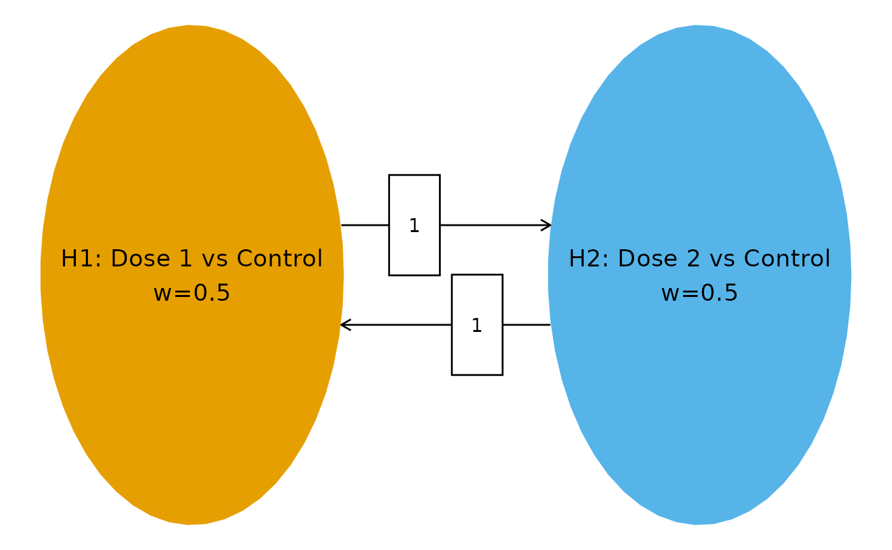

# Dunnett-type dose-finding with group sequential design

``` r

library(wpgsd)
library(gsDesign)
library(gMCPLite)
library(dplyr)
library(tibble)
library(gt)
```

## Background

A common clinical trial design compares multiple experimental dose
groups against a shared control arm. This is known as a Dunnett-type
design (Dunnett (1955)). When combined with a group sequential design
allowing interim analyses, the correlation between test statistics for
different dose-versus-control comparisons arises naturally from the
shared control arm.

The weighted parametric group sequential design (WPGSD) approach
(Anderson et al. (2022)) exploits these known correlations to produce
tighter efficacy bounds compared to the Bonferroni approach. This
vignette demonstrates the WPGSD methodology for a trial with 2
experimental dose groups versus a common control, using overall survival
(OS) as the primary endpoint, with a group sequential design having two
interim analyses and a final analysis ($`K = 3`$). Using $`K > 2`$
analyses exercises the full generality of the correlation computation
formula.

## Trial Setup

### Hypotheses

We consider 2 hypotheses, each comparing an experimental dose group to
the common control:

- $`H_1`$: Dose 1 vs. Control
- $`H_2`$: Dose 2 vs. Control

### Multiplicity Strategy

We use equal initial weights ($`w_i = 1/2`$ for each hypothesis) and
full transitions ($`m_{12} = m_{21} = 1`$). This symmetric strategy
reflects no prior preference between doses.

``` r

# Transition matrix: full transition between 2 hypotheses
m <- matrix(c(0, 1, 1, 0), nrow = 2, byrow = TRUE)

# Initial weights: equal allocation
w <- c(1 / 2, 1 / 2)

# Multiplicity graph
cbPalette <- c("#E69F00", "#56B4E9")

nameHypotheses <- c(
  "H1: Dose 1 vs Control",
  "H2: Dose 2 vs Control"
)

hplot <- hGraph(2,
  alphaHypotheses = w,
  m = m,
  nameHypotheses = nameHypotheses,
  trhw = .2, trhh = .1,
  digits = 4, trdigits = 4, size = 5, halfWid = 1.2,
  halfHgt = 0.5, offset = 0.2, trprop = 0.35,
  fill = as.factor(1:2),
  palette = cbPalette,
  wchar = "w"
)
hplot
```



### Event Counts

We assume approximately balanced event counts across treatment arms with
three analyses: two interim analyses (IA1 at ~30% information, IA2 at
~60% information) and a final analysis (FA). For OS, events are deaths
observed in each dose-versus-control comparison.

| Treatment Arm | Events at IA1 | Events at IA2 | Events at FA |
|:-------------:|:-------------:|:-------------:|:------------:|
|    Dose 1     |      20       |      40       |      65      |
|    Dose 2     |      22       |      44       |      70      |
|    Control    |      21       |      42       |      67      |

Number of events at each analysis for each treatment arm. IA1: first
interim (~30% information). IA2: second interim (~60% information). FA:
final analysis. {.table}

The diagonal entries of the event table represent total events for each
hypothesis (experimental arm + control), while off-diagonal entries
represent events shared between two comparisons (control arm events
only).

``` r

# Event counts per arm
# IA1: Dose 1=20, Dose 2=22, Control=21
# IA2: Dose 1=40, Dose 2=44, Control=42
# FA:  Dose 1=65, Dose 2=70, Control=67

# Event table: diagonal = experimental + control; off-diagonal = control only
event <- tribble(
  ~H1, ~H2, ~Analysis, ~Event,
  # IA1 diagonal (total events per hypothesis = dose + control)
  1, 1, 1, 41, # Dose 1 (20) + Control (21)
  2, 2, 1, 43, # Dose 2 (22) + Control (21)
  # IA1 off-diagonal (shared events = control only)
  1, 2, 1, 21,
  # IA2 diagonal
  1, 1, 2, 82, # Dose 1 (40) + Control (42)
  2, 2, 2, 86, # Dose 2 (44) + Control (42)
  # IA2 off-diagonal
  1, 2, 2, 42,
  # FA diagonal
  1, 1, 3, 132, # Dose 1 (65) + Control (67)
  2, 2, 3, 137, # Dose 2 (70) + Control (67)
  # FA off-diagonal
  1, 2, 3, 67
)

event %>%
  gt() %>%
  tab_header(title = "Event Count Table")
```

| Event Count Table |     |          |       |
|-------------------|-----|----------|-------|
| H1                | H2  | Analysis | Event |
| 1                 | 1   | 1        | 41    |
| 2                 | 2   | 1        | 43    |
| 1                 | 2   | 1        | 21    |
| 1                 | 1   | 2        | 82    |
| 2                 | 2   | 2        | 86    |
| 1                 | 2   | 2        | 42    |
| 1                 | 1   | 3        | 132   |
| 2                 | 2   | 3        | 137   |
| 1                 | 2   | 3        | 67    |

## Correlation Structure

### Computing Correlations

The correlation between test statistics follows the formula (Anderson et
al. (2022)):

``` math
\text{Corr}(Z_{ik}, Z_{i'k'}) = \frac{n_{i \wedge i', k \wedge k'}}{\sqrt{n_{ik} \cdot n_{i'k'}}}
```

where $`n_{i \wedge i', k \wedge k'}`$ denotes the number of events
included in both $`Z_{ik}`$ and $`Z_{i'k'}`$.

For the Dunnett-type design, the shared events between two different
dose-versus-control comparisons at the same analysis are the control arm
events. For example, at the first interim analysis:

``` math
\text{Corr}(Z_{1,1}, Z_{2,1}) = \frac{n_{\text{control, IA1}}}{\sqrt{n_{1,1} \cdot n_{2,1}}} = \frac{21}{\sqrt{41 \cdot 43}} \approx 0.500
```

With three analyses, the correlation matrix is $`6 \times 6`$ (2
hypotheses $`\times`$ 3 analyses). This exercises the general
correlation formula for all four cases:

1.  **Same hypothesis, same analysis**: $`\text{Corr} = 1`$
2.  **Same hypothesis, different analyses** ($`k < k'`$):
    $`\text{Corr}(Z_{i,k}, Z_{i,k'}) = \sqrt{n_{ik}/n_{ik'}}`$
3.  **Different hypotheses, same analysis**:
    $`\text{Corr}(Z_{i,k}, Z_{i',k}) = n_{\text{control},k}/\sqrt{n_{ik} \cdot n_{i'k}}`$
4.  **Different hypotheses, different analyses** ($`k < k'`$):
    $`\text{Corr}(Z_{i,k}, Z_{i',k'}) = n_{\text{control},k}/\sqrt{n_{ik} \cdot n_{i'k'}}`$

``` r

# Generate correlation matrix
corr <- generate_corr(event)

corr %>%
  as_tibble() %>%
  gt() %>%
  fmt_number(columns = everything(), decimals = 3) %>%
  tab_header(title = "Correlation Matrix (6 x 6)")
```

| Correlation Matrix (6 x 6) |       |       |       |       |       |
|----------------------------|-------|-------|-------|-------|-------|
| H1_A1                      | H2_A1 | H1_A2 | H2_A2 | H1_A3 | H2_A3 |
| 1.000                      | 0.500 | 0.707 | 0.354 | 0.557 | 0.280 |
| 0.500                      | 1.000 | 0.354 | 0.707 | 0.279 | 0.560 |
| 0.707                      | 0.354 | 1.000 | 0.500 | 0.788 | 0.396 |
| 0.354                      | 0.707 | 0.500 | 1.000 | 0.394 | 0.792 |
| 0.557                      | 0.279 | 0.788 | 0.394 | 1.000 | 0.498 |
| 0.280                      | 0.560 | 0.396 | 0.792 | 0.498 | 1.000 |

### Verification of Correlation Entries

We manually verify key entries of the correlation matrix to confirm
correctness for the 2-hypothesis, 3-analysis scenario.

``` r

# --- Verification of key correlation entries ---

# Case 1: Same hypothesis, same analysis -> should be 1.0
cat("Corr(Z_1,1, Z_1,1) =", corr[1, 1], " (expected: 1.0)\n")
#> Corr(Z_1,1, Z_1,1) = 1  (expected: 1.0)

# Case 2: Different hypotheses, same analysis (IA1)
# Corr(Z_1,1, Z_2,1) = n_control_IA1 / sqrt(n_H1_IA1 * n_H2_IA1) = 21 / sqrt(41 * 43)
expected_12_ia1 <- 21 / sqrt(41 * 43)
cat(
  "Corr(Z_1,1, Z_2,1) =", round(corr[1, 2], 6),
  " (expected:", round(expected_12_ia1, 6), ")\n"
)
#> Corr(Z_1,1, Z_2,1) = 0.500142  (expected: 0.500142 )

# Case 3: Different hypotheses, same analysis (FA)
# Corr(Z_1,3, Z_2,3) = n_control_FA / sqrt(n_H1_FA * n_H2_FA) = 67 / sqrt(132 * 137)
expected_12_fa <- 67 / sqrt(132 * 137)
cat(
  "Corr(Z_1,3, Z_2,3) =", round(corr[5, 6], 6),
  " (expected:", round(expected_12_fa, 6), ")\n"
)
#> Corr(Z_1,3, Z_2,3) = 0.498227  (expected: 0.498227 )

# Case 4: Same hypothesis, different analyses (IA1 vs IA2)
# Corr(Z_1,1, Z_1,2) = sqrt(n_H1_IA1 / n_H1_IA2) = sqrt(41 / 82)
expected_11_ia1_ia2 <- sqrt(41 / 82)
cat(
  "Corr(Z_1,1, Z_1,2) =", round(corr[1, 3], 6),
  " (expected:", round(expected_11_ia1_ia2, 6), ")\n"
)
#> Corr(Z_1,1, Z_1,2) = 0.707107  (expected: 0.707107 )

# Case 5: Same hypothesis, different analyses (IA1 vs FA)
# Corr(Z_1,1, Z_1,3) = sqrt(n_H1_IA1 / n_H1_FA) = sqrt(41 / 132)
expected_11_ia1_fa <- sqrt(41 / 132)
cat(
  "Corr(Z_1,1, Z_1,3) =", round(corr[1, 5], 6),
  " (expected:", round(expected_11_ia1_fa, 6), ")\n"
)
#> Corr(Z_1,1, Z_1,3) = 0.55732  (expected: 0.55732 )

# Case 6: Same hypothesis, different analyses (IA2 vs FA)
# Corr(Z_1,2, Z_1,3) = sqrt(n_H1_IA2 / n_H1_FA) = sqrt(82 / 132)
expected_11_ia2_fa <- sqrt(82 / 132)
cat(
  "Corr(Z_1,2, Z_1,3) =", round(corr[3, 5], 6),
  " (expected:", round(expected_11_ia2_fa, 6), ")\n"
)
#> Corr(Z_1,2, Z_1,3) = 0.78817  (expected: 0.78817 )

# Case 7: Different hypotheses, different analyses (IA1 vs IA2)
# Corr(Z_1,1, Z_2,2) = n_control_IA1 / sqrt(n_H1_IA1 * n_H2_IA2) = 21 / sqrt(41 * 86)
expected_12_ia1_ia2 <- 21 / sqrt(41 * 86)
cat(
  "Corr(Z_1,1, Z_2,2) =", round(corr[1, 4], 6),
  " (expected:", round(expected_12_ia1_ia2, 6), ")\n"
)
#> Corr(Z_1,1, Z_2,2) = 0.353654  (expected: 0.353654 )

# Case 8: Different hypotheses, different analyses (IA2 vs FA)
# Corr(Z_1,2, Z_2,3) = n_control_IA2 / sqrt(n_H1_IA2 * n_H2_FA) = 42 / sqrt(82 * 137)
expected_12_ia2_fa <- 42 / sqrt(82 * 137)
cat(
  "Corr(Z_1,2, Z_2,3) =", round(corr[3, 6], 6),
  " (expected:", round(expected_12_ia2_fa, 6), ")\n"
)
#> Corr(Z_1,2, Z_2,3) = 0.396262  (expected: 0.396262 )

# Case 9: Different hypotheses, different analyses (IA1 vs FA)
# Corr(Z_2,1, Z_1,3) = n_control_IA1 / sqrt(n_H2_IA1 * n_H1_FA) = 21 / sqrt(43 * 132)
expected_21_ia1_fa <- 21 / sqrt(43 * 132)
cat(
  "Corr(Z_2,1, Z_1,3) =", round(corr[2, 5], 6),
  " (expected:", round(expected_21_ia1_fa, 6), ")\n"
)
#> Corr(Z_2,1, Z_1,3) = 0.278739  (expected: 0.278739 )
```

``` r

# Verify matrix is positive definite
eigenvalues <- eigen(corr)$values
cat("Eigenvalues:", round(eigenvalues, 6), "\n")
#> Eigenvalues: 3.562329 1.18783 0.672484 0.263761 0.224982 0.088615
cat("All positive:", all(eigenvalues > 0), "\n")
#> All positive: TRUE
```

The correlation matrix for this 2-hypothesis, 3-analysis Dunnett
scenario has the following structure:

- **Same analysis, different hypotheses**: Correlation $`\approx 0.50`$,
  driven by the shared control arm. With balanced arms, this approaches
  $`n_C / (n_C + n_E) \approx 0.5`$ when $`n_C \approx n_E`$.
- **Same hypothesis, adjacent analyses**: Correlation $`\approx 0.71`$
  (IA1 vs IA2) and $`\approx 0.79`$ (IA2 vs FA), following
  $`\sqrt{n_{ik}/n_{ik'}}`$.
- **Same hypothesis, non-adjacent analyses**: Correlation
  $`\approx 0.56`$ (IA1 vs FA), demonstrating the general formula for
  $`K > 2`$ analyses.
- **Different hypotheses, different analyses**: Correlation
  $`\approx 0.35`$ (IA1 vs IA2) and $`\approx 0.40`$ (IA2 vs FA),
  combining both sources of correlation.

## Futility Bounds

We use `gsDesign` to compute common non-binding futility bounds at the
interim analyses. These bounds apply equally to both dose arms. The
futility bounds are based on a beta-spending approach using a
Hwang-Shih-DeCani spending function.

``` r

# Group sequential design with non-binding futility
# Average information fraction across hypotheses at each analysis
IF_avg <- c(
  mean(c(41 / 132, 43 / 137)),
  mean(c(82 / 132, 86 / 137)),
  1
)

gs_design <- gsDesign(
  k = 3,
  test.type = 4, # Non-binding futility
  alpha = 0.025 / 2, # Per-hypothesis alpha (Bonferroni for single hypothesis)
  beta = 0.1,
  timing = IF_avg[1:2],
  sfu = sfLDOF, # Lan-DeMets O'Brien-Fleming for efficacy
  sfl = sfHSD, # HSD for futility
  sflpar = -2
)

# Futility bounds (on p-value scale)
futility_z <- gs_design$lower$bound
futility_p <- pnorm(futility_z)

cat("Information fractions:", round(IF_avg, 3), "\n")
#> Information fractions: 0.312 0.624 1
cat("Futility Z-bounds:", round(futility_z, 4), "\n")
#> Futility Z-bounds: -0.1898 1.0006 2.2574
cat("Futility p-value bounds:", round(futility_p, 4), "\n")
#> Futility p-value bounds: 0.4247 0.8415 0.988
```

``` r

# Display the gsDesign summary
tibble(
  Analysis = c("IA1", "IA2", "FA"),
  `Information Fraction` = round(IF_avg, 3),
  `Futility Z-bound` = round(gs_design$lower$bound, 4),
  `Futility p-value` = round(pnorm(gs_design$lower$bound), 4)
) %>%
  gt() %>%
  tab_header(title = "Non-binding Futility Bounds (Common Across Both Doses)")
```

| Non-binding Futility Bounds (Common Across Both Doses) |  |  |  |
|----|----|----|----|
| Analysis | Information Fraction | Futility Z-bound | Futility p-value |
| IA1 | 0.312 | -0.1898 | 0.4247 |
| IA2 | 0.624 | 1.0006 | 0.8415 |
| FA | 1.000 | 2.2574 | 0.9880 |

The futility bound is applied as a common bar: at each interim analysis,
any dose arm with a one-sided p-value exceeding the futility threshold
may be dropped for futility. This is a non-binding bound, meaning it
does not affect the Type I error control of the efficacy bounds.

## Efficacy Bounds

### Information Fractions

Each hypothesis has its own information fraction based on the ratio of
events at each analysis to the final analysis.

``` r

# Information fractions for each hypothesis
IF_H1 <- c(41 / 132, 82 / 132, 1)
IF_H2 <- c(43 / 137, 86 / 137, 1)

tibble(
  Hypothesis = c("H1", "H2"),
  `IF at IA1` = round(c(IF_H1[1], IF_H2[1]), 3),
  `IF at IA2` = round(c(IF_H1[2], IF_H2[2]), 3),
  `IF at FA` = 1
) %>%
  gt() %>%
  tab_header(title = "Information Fractions")
```

| Information Fractions |           |           |          |
|-----------------------|-----------|-----------|----------|
| Hypothesis            | IF at IA1 | IF at IA2 | IF at FA |
| H1                    | 0.311     | 0.621     | 1        |
| H2                    | 0.314     | 0.628     | 1        |

### Bonferroni Bounds

We first compute Bonferroni bounds (Type 0) as a reference, using
Lan-DeMets O’Brien-Fleming spending for each hypothesis.

``` r

# Bonferroni bounds
bound_Bonf <- generate_bounds(
  type = 0, k = 3, w = w, m = m,
  corr = corr, alpha = 0.025,
  sf = list(sfLDOF, sfLDOF),
  sfparm = list(0, 0),
  t = list(IF_H1, IF_H2)
)

bound_Bonf %>%
  gt() %>%
  fmt_number(columns = 3:4, decimals = 6) %>%
  tab_header(title = "Bonferroni Bounds (Type 0)")
```

| Bonferroni Bounds (Type 0) |            |          |          |
|----------------------------|------------|----------|----------|
| Analysis                   | Hypotheses | H1       | H2       |
| 1                          | H1         | 0.000058 | NA       |
| 1                          | H1, H2     | 0.000007 | 0.000008 |
| 1                          | H2         | NA       | 0.000063 |
| 2                          | H1         | 0.004437 | NA       |
| 2                          | H1, H2     | 0.001527 | 0.001616 |
| 2                          | H2         | NA       | 0.004647 |
| 3                          | H1         | 0.023599 | NA       |
| 3                          | H1, H2     | 0.012006 | 0.011978 |
| 3                          | H2         | NA       | 0.023536 |

### WPGSD Bounds

We compute WPGSD bounds using $`\alpha`$-spending approach 2 (Type 3,
separate spending per hypothesis), which applies an inflation factor
$`\xi`$ to the Bonferroni nominal boundaries.

``` r

set.seed(1234)

# WPGSD bounds with separate alpha spending (Type 3)
bound_WPGSD <- generate_bounds(
  type = 3, k = 3, w = w, m = m,
  corr = corr, alpha = 0.025,
  sf = list(sfLDOF, sfLDOF),
  sfparm = list(0, 0),
  t = list(IF_H1, IF_H2)
)

bound_WPGSD %>%
  gt() %>%
  fmt_number(columns = 3:4, decimals = 6) %>%
  tab_header(title = "WPGSD Bounds (Type 3, Separate Spending)")
```

| WPGSD Bounds (Type 3, Separate Spending) |  |  |  |  |
|----|----|----|----|----|
| Analysis | Hypotheses | H1 | H2 | xi |
| 1 | H1 | 0.000058 | NA | 1.000000 |
| 1 | H1, H2 | 0.000007 | 0.000008 | 1.004683 |
| 1 | H2 | NA | 0.000063 | 1.000000 |
| 2 | H1 | 0.004437 | NA | 1.000000 |
| 2 | H1, H2 | 0.001578 | 0.001670 | 1.033524 |
| 2 | H2 | NA | 0.004647 | 1.000000 |
| 3 | H1 | 0.023599 | NA | 1.000000 |
| 3 | H1, H2 | 0.012984 | 0.012954 | 1.081468 |
| 3 | H2 | NA | 0.023536 | 1.000000 |

### Comparison: Bonferroni vs. WPGSD

| Bonferroni vs. WPGSD Bounds |  |  |  |  |  |  |
|----|----|----|----|----|----|----|
| Analysis | Hypotheses | H1.B | H2.B | H1.W | H2.W | xi |
| 1.000000 | H1 | 0.000058 | NA | 0.000058 | NA | 1.000000 |
| 1.000000 | H1, H2 | 0.000007 | 0.000008 | 0.000007 | 0.000008 | 1.004683 |
| 1.000000 | H2 | NA | 0.000063 | NA | 0.000063 | 1.000000 |
| 2.000000 | H1 | 0.004437 | NA | 0.004437 | NA | 1.000000 |
| 2.000000 | H1, H2 | 0.001527 | 0.001616 | 0.001578 | 0.001670 | 1.033524 |
| 2.000000 | H2 | NA | 0.004647 | NA | 0.004647 | 1.000000 |
| 3.000000 | H1 | 0.023599 | NA | 0.023599 | NA | 1.000000 |
| 3.000000 | H1, H2 | 0.012006 | 0.011978 | 0.012984 | 0.012954 | 1.081468 |
| 3.000000 | H2 | NA | 0.023536 | NA | 0.023536 | 1.000000 |

The WPGSD bounds are less conservative than the Bonferroni bounds
because they account for the positive correlation induced by the shared
control arm. With 2 dose groups sharing a common control, the
correlations within the same analysis are substantial (~0.50), and the
WPGSD approach provides a meaningful improvement.

## Combined Efficacy and Futility Summary

``` r

# Extract elementary hypothesis bounds at each analysis for both methods
elementary_hyps <- c("H1", "H2")

# Get WPGSD bounds for elementary hypotheses
wpgsd_elem <- bound_WPGSD %>%
  filter(Hypotheses %in% elementary_hyps)

bonf_elem <- bound_Bonf %>%
  filter(Hypotheses %in% elementary_hyps)

# Summary table
summary_tbl <- tibble(
  Hypothesis = rep(elementary_hyps, each = 3),
  Analysis = rep(c("IA1", "IA2", "FA"), 2),
  `Bonferroni p-bound` = NA_real_,
  `WPGSD p-bound` = NA_real_,
  `Futility p-bound` = NA_real_
)

for (i in seq_along(elementary_hyps)) {
  h <- elementary_hyps[i]
  bonf_row <- bonf_elem %>% filter(Hypotheses == h)
  wpgsd_row <- wpgsd_elem %>% filter(Hypotheses == h)

  for (k in 1:3) {
    row_idx <- (i - 1) * 3 + k
    summary_tbl$`Bonferroni p-bound`[row_idx] <- as.numeric(bonf_row[bonf_row$Analysis == k, h])
    summary_tbl$`WPGSD p-bound`[row_idx] <- as.numeric(wpgsd_row[wpgsd_row$Analysis == k, h])
    if (k <= 2) {
      summary_tbl$`Futility p-bound`[row_idx] <- futility_p[k]
    } else {
      summary_tbl$`Futility p-bound`[row_idx] <- NA
    }
  }
}

summary_tbl %>%
  gt() %>%
  fmt_number(columns = 3:5, decimals = 6) %>%
  sub_missing(missing_text = "-") %>%
  tab_header(
    title = "Combined Efficacy and Futility Bounds",
    subtitle = "Futility applied as common non-binding bars at interim analyses"
  )
```

| Combined Efficacy and Futility Bounds |  |  |  |  |
|----|----|----|----|----|
| Futility applied as common non-binding bars at interim analyses |  |  |  |  |
| Hypothesis | Analysis | Bonferroni p-bound | WPGSD p-bound | Futility p-bound |
| H1 | IA1 | 0.000058 | 0.000058 | 0.424726 |
| H1 | IA2 | 0.004437 | 0.004437 | 0.841493 |
| H1 | FA | 0.023599 | 0.023599 | \- |
| H2 | IA1 | 0.000063 | 0.000063 | 0.424726 |
| H2 | IA2 | 0.004647 | 0.004647 | 0.841493 |
| H2 | FA | 0.023536 | 0.023536 | \- |

## Closed Testing

We demonstrate the closed testing procedure with hypothetical observed
p-values. Suppose at IA1 we see a strong signal for Dose 2 but not
Dose 1. At IA2 both doses show improvement. At the final analysis, Dose
2 confirms strong efficacy.

``` r

# Observed p-values (hypothetical)
p_obs <- tribble(
  ~Analysis, ~H1, ~H2,
  1, 0.20, 0.004,
  2, 0.05, 0.002,
  3, 0.02, 0.001
)

p_obs %>%
  gt() %>%
  fmt_number(columns = 2:3, decimals = 6, drop_trailing_zeros = TRUE) %>%
  tab_header(title = "Observed Nominal p-Values")
```

| Observed Nominal p-Values |      |       |
|---------------------------|------|-------|
| Analysis                  | H1   | H2    |
| 1                         | 0.2  | 0.004 |
| 2                         | 0.05 | 0.002 |
| 3                         | 0.02 | 0.001 |

``` r

# Apply closed testing procedure
test_result <- closed_test(bound_WPGSD, p_obs)

test_result %>%
  gt() %>%
  tab_header(title = "Closed Testing Results (WPGSD)")
```

| Closed Testing Results (WPGSD) |         |            |
|--------------------------------|---------|------------|
| H1                             | H2      | Analysis   |
| Fail                           | Fail    | Analysis 1 |
| Fail                           | Fail    | Analysis 2 |
| Success                        | Success | Analysis 3 |

``` r

# Compare with Bonferroni closed testing
test_result_bonf <- closed_test(bound_Bonf, p_obs)

test_result_bonf %>%
  gt() %>%
  tab_header(title = "Closed Testing Results (Bonferroni)")
```

| Closed Testing Results (Bonferroni) |         |            |
|-------------------------------------|---------|------------|
| H1                                  | H2      | Analysis   |
| Fail                                | Fail    | Analysis 1 |
| Fail                                | Fail    | Analysis 2 |
| Success                             | Success | Analysis 3 |

### Futility Assessment

At each interim analysis, we also check each dose against the common
futility bar:

``` r

# Futility assessment at IA1 and IA2
futility_check <- tibble(
  Hypothesis = rep(c("H1", "H2"), 2),
  Analysis = rep(c("IA1", "IA2"), each = 2),
  `Observed p` = c(0.20, 0.004, 0.05, 0.002),
  `Futility bound` = rep(futility_p[1:2], each = 2),
  `Drop for futility?` = ifelse(
    c(0.20, 0.004, 0.05, 0.002) > rep(futility_p[1:2], each = 2),
    "Yes", "No"
  )
)

futility_check %>%
  gt() %>%
  fmt_number(columns = 3:4, decimals = 4) %>%
  tab_header(
    title = "Futility Assessment at Interim Analyses",
    subtitle = "Common non-binding futility threshold at each interim"
  )
```

| Futility Assessment at Interim Analyses |  |  |  |  |
|----|----|----|----|----|
| Common non-binding futility threshold at each interim |  |  |  |  |
| Hypothesis | Analysis | Observed p | Futility bound | Drop for futility? |
| H1 | IA1 | 0.2000 | 0.4247 | No |
| H2 | IA1 | 0.0040 | 0.4247 | No |
| H1 | IA2 | 0.0500 | 0.8415 | No |
| H2 | IA2 | 0.0020 | 0.8415 | No |

## Discussion

This vignette demonstrates the WPGSD approach for a Dunnett-type
dose-finding trial with 2 experimental arms versus a common control and
3 analyses (2 interims + final). Key observations:

1.  **Correlation structure**: The shared control arm induces positive
    correlations of approximately 0.50 between test statistics for
    different dose-versus-control comparisons at the same analysis. This
    correlation is substantial and directly exploitable by the WPGSD
    approach.

2.  **Three analyses**: Using $`K = 3`$ analyses demonstrates the full
    generality of the correlation formula. The within-hypothesis
    correlations across non-adjacent analyses (e.g., IA1 vs. FA) are
    correctly computed as $`\sqrt{n_{ik}/n_{ik'}}`$, and the
    cross-hypothesis, cross-analysis correlations use the shared events
    at the earlier analysis.

3.  **Bound improvement**: The WPGSD bounds are less conservative than
    Bonferroni bounds, providing increased nominal significance levels
    at all three analyses. This gain comes at no cost to FWER control.

4.  **Futility**: Common non-binding futility bounds are computed
    externally via `gsDesign` with $`K = 3`$ and applied as screening
    criteria at each interim analysis. Since the futility bounds are
    non-binding, they do not affect the WPGSD efficacy bounds or FWER
    control.

5.  **Closed testing**: The closed testing procedure is necessary for
    FWER control. With 2 hypotheses, there are $`2^2 - 1 = 3`$
    intersection hypotheses to evaluate, making the procedure
    straightforward.

## References

Anderson, Keaven M, Zifang Guo, Jing Zhao, and Linda Z Sun. 2022. “A
Unified Framework for Weighted Parametric Group Sequential Design.”
*Biometrical Journal* 64 (7): 1219–39.

Dunnett, Charles W. 1955. “A Multiple Comparison Procedure for Comparing
Several Treatments with a Control.” *Journal of the American Statistical
Association* 50 (272): 1096–121.
