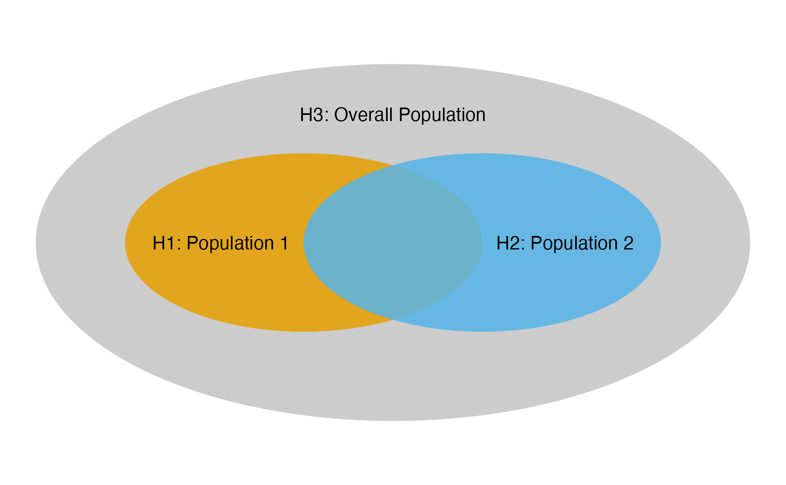

```{r, include = FALSE}
knitr::opts_chunk$set(
  collapse = TRUE,
  comment = "#>",
  error = TRUE,
  fig.align = "center"
)
```

```{r, message=FALSE, warning=FALSE}
library(wpgsd)
library(gsDesign)
library(gMCPLite)
library(haven)
library(dplyr)
library(tidyr)
library(reshape2)
library(kableExtra)
```

# Background

The  weighted parametric group sequential design (WPGSD) (@anderson2022unified) approach allows one to take advantage of the known correlation structure in constructing efficacy bounds to control family-wise error rate (FWER) for a group sequential design. Here correlation may be due to common observations in nested populations, due to common observations in overlapping populations, or due to common observations in the control arm. This document illustrates the use of the R package wpgsd to implement this approach.

# Methods and Examples

## Closed Testing and Parametric Tests

We aim to control the familywise error rate (FWER) at level $\alpha$. Let $J \subseteq I$. The intersection hypothesis $H_J$ assumes the null hypothesis for all individual hypotheses $H_i$ with $i \in J$. Closed testing principle is as follows: if for all sets $J \subseteq I$ with $j \in J$, $H_J$ can be rejected at level $\alpha$, then $H_j$ can be rejected. Weighted parametric tests can be used for this: @bretz2011graphical, @xi2017unified for fixed designs or @maurer2013multiple for group sequential.

## Consonance

A closed procedure is called consonant if the rejection of the complete intersection null hypothesis $H_I$ further  implies  that  at  least  one  elementary  hypothesis $H_i, i \in I$,  is rejected.  Consonance is a desirable property leading to short-cut procedures that give the same rejection decisions as the original closed procedure but with fewer operations. For WPGSD, consonance does not always hold and in general the closed-testing procedure is required.

## Group Sequential Design Notations and Assumptions

- A set $I$ of hypotheses for $i \in I$.
- $K$ group sequential analyses, $k = 1, \ldots, K$
- Single endpoint
    * Not required, and can be generalized
- Assume tests $Z_{ik}$, $i \in I$, $1 \leq k \leq K$ where a large $Z_{ik}$ is used to reject $H_i$

## Correlation Structure

- Notation
    * Events for individual hypothesis $H_i$,$i \in I$ at analysis k denoted by $n_{ik}$.
    * Assume the same endpoint for all hypotheses (can be relaxed)
    * For binary or continuous outcomes $n_{ik}$ represents sample size
    * $Z_{ik}$ is standardized normal test for treatment effect for individual hypothesis $H_i$ at analysis $k$
    * Denote $n_{i\wedge i^\prime,k\wedge k^\prime}$ as the number of observations (or events) included in both $Z_{ik}$ and $Z_{i^\prime k^\prime}$, $i\in I$, $1\le k\le K$.
- Key result
  $$  \hbox{Corr}(Z_{ik}, Z_{i^\prime k^\prime }) =  \frac{n_{i\wedge i^\prime ,k\wedge k^\prime }}{\sqrt{n_{ik}n_{i^\prime k^\prime }}} $$
- Proof builds on standard group sequential theory (@chen2021multiplicity)

## Example 1: Overlapping Populations, Two Analyses

Following illustrates the first example, which has overlapping populations (e.g. due to biomarker) and is also example 1 in @anderson2022unified.

```{r, eval=FALSE, echo=FALSE}
library(ggplot2)
library(ggforce)

ellipse_data <- data.frame(
  id = c("H1: Population 1", "H2: Population 2", "H3: Overall Population"),
  x = c(0, 1, 0.5),
  y = c(0, 0, 0),
  a = c(1, 1, 2),
  b = c(0.5, 0.5, 1)
)

ragg::agg_png(
  "vignettes/figures/ex1-pop.png",
  width = 1920,
  height = 1920 / 1.618,
  res = 96,
  scaling = 2
)
ggplot() +
  geom_ellipse(
    aes(
      x0 = x, y0 = y, a = a, b = b, angle = 0, fill = id
    ),
    data = ellipse_data[ellipse_data$id == "H3: Overall Population", ],
    color = NA, alpha = 0.5, show.legend = FALSE
  ) +
  geom_ellipse(
    aes(
      x0 = x, y0 = y, a = a, b = b, angle = 0, fill = id
    ),
    data = ellipse_data[ellipse_data$id != "H3: Overall Population", ],
    color = NA, alpha = 0.85, show.legend = FALSE
  ) +
  geom_text(aes(
    x = x, y = y, label = id,
    hjust = ifelse(id == "H1: Population 1", 1.1,
      ifelse(id == "H2: Population 2", -0.1, 0.5)
    ),
    vjust = ifelse(id == "H3: Overall Population", -9, 0.5)
  ), data = ellipse_data, size = 6) +
  scale_fill_manual(values = c("#E69F00", "#56B4E9", "#999999"), guide = "none") +
  coord_fixed() +
  theme_void()
dev.off()
```

```{r, echo=FALSE, out.width="90%", fig.cap="Ex1: Populations"}

```

The multiplicity strategy is defined as follows.

```{r, out.width="80%"}
# Transition matrix
m <- matrix(c(
  0, 0, 1,
  0, 0, 1,
  0.5, 0.5, 0
), nrow = 3, byrow = TRUE)
# Weight matrix
w <- c(0.3, 0.3, 0.4)

# Multiplicity graph
cbPalette <- c("#999999", "#E69F00", "#56B4E9")

nameHypotheses <- c(
  "H1: Population 1",
  "H2: Population 2",
  "H3: Overall Population"
)

hplot <- hGraph(3,
  alphaHypotheses = w,
  m = m,
  nameHypotheses = nameHypotheses,
  trhw = .2, trhh = .1,
  digits = 5, trdigits = 3, size = 5, halfWid = 1,
  halfHgt = 0.5, offset = 0.2, trprop = 0.4,
  fill = as.factor(c(2, 3, 1)),
  palette = cbPalette,
  wchar = "w"
)
hplot
```

The event count of each hypothesis at each analysis is shown below.

| Population            | Number of Events at IA | Number of Events at FA |
|:---------------------:|:----------------------:|:----------------------:|
| Population 1          | 100                    | 200                    |
| Population 2          | 110                    | 220                    |
| Population 1 $\cap$ 2 | 80                     | 160                    |
| Overall Population    | 225                    | 450                    |

Table: Number of events at each analysis for each population in Example 1.
IA: interim analysis. FA: final analysis.

The correlation matrix among test statistics is as follows.

| $i,k$ | 1,1 | 2,1 | 3,1 | 1,2 | 2,2 | 3,2 |
|:---:|:---:|:---:|:---:|:---:|:---:|:---:|
| 1,1 | 1 | $\frac{80}{\sqrt{100\cdot 110}}$ | $\frac{100}{\sqrt{100 \cdot 225}}$ | $\frac{100}{\sqrt{100\cdot 200}}$ | $\frac{80}{\sqrt{100\cdot 220}}$ | $\frac{100}{\sqrt{100 \cdot 450}}$ |
| 2,1 | 0.76 | 1 | $\frac{110}{\sqrt{110 \cdot 225}}$ | $\frac{80}{\sqrt{110\cdot 200}}$ | $\frac{110}{\sqrt{110\cdot 220}}$ | $\frac{110}{\sqrt{110 \cdot 450}}$ |
| 3,1 | 0.67 | 0.70 | 1 | $\frac{100}{\sqrt{225 \cdot 200}}$ | $\frac{110}{\sqrt{225 \cdot 220}}$ | $\frac{225}{\sqrt{225 \cdot 450}}$ |
| 1,2 | 0.71 | 0.54 | 0.47 | 1 | $\frac{160}{\sqrt{200 \cdot 220}}$ | $\frac{200}{\sqrt{200 \cdot 450}}$ |
| 2,2 | 0.54 | 0.71 | 0.49 | 0.76 | 1 | $\frac{220}{\sqrt{220 \cdot 450}}$ |
| 3,2 | 0.47 | 0.49 | 0.71 | 0.67 | 0.70 | 1 |

Table: Correlation Matrix of Test Statistics for Example 1.
Identical numeric values (lower triangular) and formulas (upper triangular) shown.

## Example 2: Common Control, Two Analyses

Following illustrates the second example in which correlation comes from common control arm. This is also example 2 in @anderson2022unified.

```{r, out.width="80%", echo = FALSE}
cbPalette <- c(
  "#999999", "#E69F00", "#56B4E9", "#009E73",
  "#F0E442", "#0072B2", "#D55E00", "#CC79A7"
)
nameHypotheses <- c(
  "H1: Experimental 1 vs Control",
  "H2: Experimental 2 vs Control",
  "H3: Experimental 3 vs Control"
)
m <- matrix(c(
  0, 0.5, 0.5,
  0.5, 0, 0.5,
  0.5, 0.5, 0
), nrow = 3, byrow = TRUE)
alphaHypotheses <- c(1 / 3, 1 / 3, 1 / 3)

hplot <- hGraph(3,
  alphaHypotheses = alphaHypotheses, m = m,
  nameHypotheses = nameHypotheses, trhw = .2, trhh = .1,
  digits = 3, trdigits = 4, size = 5, halfWid = 1.2, halfHgt = 0.5,
  offset = 0.2, trprop = 0.35,
  fill = as.factor(c(2, 3, 1)),
  palette = cbPalette[1:3],
  wchar = "w"
)
hplot
```

| Treatment Arm  | Number of Events at IA | Number of Events at FA |
|:--------------:|:----------------------:|:----------------------:|
| Experimental 1 | 70                     | 135                    |
| Experimental 2 | 75                     | 150                    |
| Experimental 3 | 80                     | 165                    |
| Control        | 85                     | 170                    |

Table: Number of events at each analysis for each treatment arm in Example 2.
IA: interim analysis. FA: final analysis.

| $i,k$ | 1,1 | 2,1 | 3,1 | 1,2 | 2,2 | 3,2 |
|:---:|:---:|:---:|:---:|:---:|:---:|:---:|
| 1,1 | 1 | $\frac{85}{\sqrt{155\cdot 160}}$ | $\frac{85}{\sqrt{155 \cdot 165}}$ | $\frac{155}{\sqrt{155\cdot 305}}$ | $\frac{85}{\sqrt{155\cdot 320}}$ | $\frac{85}{\sqrt{155 \cdot 335}}$ |
| 2,1 | 0.54 | 1 | $\frac{85}{\sqrt{160 \cdot 165}}$ | $\frac{85}{\sqrt{160 \cdot 305}}$ | $\frac{160}{\sqrt{160\cdot 320}}$ | $\frac{85}{\sqrt{160 \cdot 335}}$ |
| 3,1 | 0.53 | 0.52 | 1 | $\frac{85}{\sqrt{165 \cdot 305}}$ | $\frac{85}{\sqrt{165\cdot 320}}$ | $\frac{165}{\sqrt{165 \cdot 335}}$ |
| 1,2 | 0.71 | 0.38 | 0.38 | 1 | $\frac{170}{\sqrt{305\cdot 320}}$ | $\frac{170}{\sqrt{305 \cdot 335}}$ |
| 2,2 | 0.38 | 0.71 | 0.37 | 0.54 | 1 | $\frac{170}{\sqrt{320 \cdot 335}}$ |
| 3,2 | 0.37 | 0.37 | 0.70 | 0.53 | 0.52 | 1 |

Table: Correlation Matrix for Example 2.
Identical numeric values (lower triangular) and formulas (upper triangular) shown.

## Hypotheses Set

These 2 examples each has 7 intersection hypotheses and the corresponding weighting strategies are illustrated below.

| $H_J$                   | $w_1(J)$ | $w_2(J)$ | $w_3(J)$ |
|:-----------------------:|:--------:|:--------:|:--------:|
| $H_1 \cap H_2 \cap H_3$ | 0.3      | 0.3      | 0.4      |
| $H_1 \cap H_2$          | 0.5      | 0.5      | -        |
| $H_1 \cap H_3$          | 0.3      | -        | 0.7      |
| $H_2 \cap H_3$          | -        | 0.3      | 0.7      |
| $H_1$                   | 1        | -        | -        |
| $H_2$                   | -        | 1        | -        |
| $H_3$                   | -        | -        | 1        |

Table: Weighting strategy of Example 1.

| $H_J$                   | $w_1(J)$ | $w_2(J)$ | $w_3(J)$ |
|:-----------------------:|:--------:|:--------:|:--------:|
| $H_1 \cap H_2 \cap H_3$ | 1/3      | 1/3      | 1/3      |
| $H_1 \cap H_2$          | 1/2      | 1/2      | -        |
| $H_1 \cap H_3$          | 1/2      | -        | 1/2      |
| $H_2 \cap H_3$          | -        | 1/2      | 1/2      |
| $H_1$                   | 1        | -        | -        |
| $H_2$                   | -        | 1        | -        |
| $H_3$                   | -        | -        | 1        |

Table: Weighting strategy of Example 2.

## $\alpha$ Spending: 3 approaches

The WPGSD approach uses all known correlations between tests in the study. This relaxes bounds and allows increased power or smaller sample size. Three spending approaches have been proposed:

- Fixed spending (Fleming-Harrington-O'Brien (FHO) approach). Specify $0 < \alpha_1(J) < \alpha_2(J) < \ldots < \alpha_K(J) = \alpha(J) \leq \alpha$ for all $J\subseteq I$, where $\alpha(J)$ is the total alpha for intersection hypothesis $H_J$ according to the graphical approach.

- $\alpha$-spending approach 1. We choose a spending function family $f(t,\alpha)$ and set $\alpha_k(J)=f(t_k(J),\alpha(J))$ for $1\le k\le K$ for all intersection hypotheses $J\subseteq I$.

- $\alpha$-spending approach 2. For each elementary hypothesis $i$ ($i$ = 1, 2, \ldots, $m$), specify the $\alpha$-spending function family $f_i(t,\gamma)$ where $\gamma$ is the $\alpha$ level for the hypothesis and $f_i(t_{ik},\gamma)$ determines how much $\alpha$ to spend up to analysis $k$ for hypothesis $i$ when level $\gamma$ is allocated to the hypothesis. Then $\alpha_k(J) = \sum_{i \in J} f_i(t_{ik}, w_i(J)\alpha)$.

## Bounds Computation: Parametric Test, Fixed Design (For Example, Two Populations, One Analysis)

- Assume ($Z_1,Z_2$) bivariate normal with known correlation

- Find $\alpha$-inflation factor $c_J$ such that
 $$ \alpha = P[\cup_{i \in J} \{p_i \leq c_Jw_{J,i}\alpha \}] = P[\cup_{i \in J} \{Z_i \geq \Phi^{-1}(1-c_Jw_{J,i}\alpha \}]$$

- Basic algorithm code in @bretz2011graphical

### Bounds Computation: WPGSD - Fixed spending and $\alpha$ spending approach 1 {.smaller}

- Assume for $j < k$ that bounds $c_{ij} (J), i \in J, j < k$, have already been set and remain unchanged.

- At analysis $k$, compute the correlation matrix of $Z_{ij}$, $i \in J$, $j = 1, \ldots, k$.

    i Initialize $\alpha_{k}^{*}(J) = \alpha_{k}(J) - \alpha_{k-1}(J)$.

    ii Set $b_{ik} = \Phi^{-1}(1 - w_{i}(J)\alpha_{k}^{*} (J))$, $i\in J$.

    iii Compute type I error rate up to analysis $k$
           $$ 1 - Pr(\cap_{i \in J} \{ Z_{ik} < b_{ik} \} \cap_{i \in J, j < k} \{ Z_{ij} < c_{ij}(J) \} ). $$

    iv Update $\alpha_{k}^{*}(J)$ using root-finding with steps ii - iii until the type I error rate through analysis $k$ is controlled at $\alpha_{k}(J)$  for $H_J$.  That is,
          $$ 1 - Pr(\cap_{i \in J} \{ Z_{ik} < b_{ik} \} \cap_{i \in J, j < k} \{ Z_{ij} < c_{ij}(J) \} ) = \alpha_{k}. $$

    v Set $c_{ik}(J) = b_{ik}$ from the previous step. The corresponding nominal $p$-value boundary is $p_{ik}(J)= 1-\Phi(c_{ik}(J)) =  w_i(J)\alpha_k^*(J)$.

- Note: interim bound does not depend on future analyses. Solution only requires root finding for a single $\alpha_{k}^{*}(J)$ at a time, $k = 1, \ldots, K$. Requires multivariate normal computation from mvtnorm R package Genz et al. (2020).

### Bounds Computation: WPGSD - $\alpha$ spending approach 2 {.smaller}

- Assume for $j < k$ that bounds $c_{ij} (J), i \in J, j < k$, have already been set and remain unchanged.

- At analysis $k$, compute the correlation matrix of $Z_{ij}$, $i \in J$, $j = 1, \ldots, k$.

    i Determine what the nominal $p$-value boundary would be for each elementary hypothesis in $J$ for a weighted Bonferroni test in a group sequential design as described in @maurer2013multiple. Let these nominal $p$-value boundaries be $\alpha^\prime_{ik}(J)$.

    ii Choose an inflation factor $\xi_{k}(J) > 1$ and set $$b_{ik} = \Phi^{-1}(1 - \xi_k(J) \alpha^\prime_{ik}(J)).$$

    iii Update $\xi_k(J)$ until this type I error rate up to analysis $k$ is controlled at $\alpha_{k}(J)$  for $H_J$.  That is,
           $$ 1 - Pr(\cap_{i \in J} \{ Z_{ik} < b_{ik} \} \cap_{i \in J, j < k} \{ Z_{ij} < c_{ij}(J) \} ) = \alpha_{k}(J).$$

    iv After the appropriate $\xi_k(J)$ has been derived, the nominal $p$-value boundaries are $p_{ik}(J)=\xi_k(J) \alpha^\prime_{ik}(J)$, and $b_{ik}$ is computed as in step ii, we set $c_{ik}(J) = b_{ik}$.

- Note: interim bound does not depend on future analyses. Solution only requires root finding for a single $\xi_k(J)$ at a time, $k = 1, \ldots, K$. Requires multivariate normal computation from the mvtnorm R package Genz et al. (2020).

## Implementation of Example 1 with Overlapping Populations

We first define the transition matrix and weights as shown above in Section 2.5. Next we set up the event count table as follows:

- Analysis: Analysis number (1 for interim, 2 for final).
- Event: Event counts.
- H1, H2: Hypotheses intersected.
    * (1, 1) represents counts for hypothesis 1
    * (1, 2) for counts for the intersection of hypotheses 1 and 2

```{r}
event <- tribble(
  ~H1, ~H2, ~Analysis, ~Event,
  1, 1, 1, 100,
  2, 2, 1, 110,
  3, 3, 1, 225,
  1, 2, 1, 80,
  1, 3, 1, 100,
  2, 3, 1, 110,
  1, 1, 2, 200,
  2, 2, 2, 220,
  3, 3, 2, 450,
  1, 2, 2, 160,
  1, 3, 2, 200,
  2, 3, 2, 220
)
event %>%
  kbl(caption = "Event Count", align = "l") %>%
  kable_classic_2(full_width = FALSE)
```

```{r}
# Alternatively, one can manually enter paths for analysis datasets,
# example below uses an example dataset assuming currently we are at IA1.
paths <- system.file("extdata/", package = "wpgsd")

### Generate event count table from ADSL and ADTTE datasets
# Selection criteria for each hypothesis
h_select <- tribble(
  ~Hypothesis, ~Crit,
  1, "PARAMCD=='OS' & TRT01P %in% c('Xanomeline High Dose', 'Placebo')",
  2, "PARAMCD=='OS' & TRT01P %in% c('Xanomeline Low Dose', 'Placebo')"
)

event2 <- generate_event_table(paths, h_select,
  adsl_name = "adsl", adtte_name = "adtte",
  key_var = "USUBJID", cnsr_var = "CNSR"
)$event

event2 %>%
  kbl(caption = "Event Count - Compute from SAS Datasets Example", align = "l") %>%
  kable_classic_2(full_width = FALSE)
```

Then we compute correlation matrix using the event count table and `generate_corr()`. We see that the correlations not accounted for by the Bonferroni approach are substantial and, thus, might expect a non-trivial impact on bounds for hypothesis tests.

```{r}
## Generate correlation from events
corr <- generate_corr(event)

corr %>%
  kbl(caption = "Correlation Matrix", align = "l", digits = 2) %>%
  kable_classic_2(full_width = FALSE)
```

Bonferroni and WPGSD bounds can then be computed via `generate_bounds()`. In this example, we useHSD(-4) as $\alpha$-spending for all hypotheses. Of note, `generate_bounds()` input type specifies boundary type.

- 0 = Bonferroni. Separate alpha spending for each hypotheses.
- 1 = Fixed alpha spending for all hypotheses. Method 3a in the manuscript.
- 2 = Overall alpha spending for all hypotheses. Method 3b in the manuscript.
- 3 = Separate alpha spending for each hypotheses. Method 3c in the manuscript.

Compute Bonferroni bounds.
```{r}
# Bonferroni bounds
bound_Bonf <- generate_bounds(
  type = 0, k = 2, w = w, m = m,
  corr = corr, alpha = 0.025,
  sf = list(sfHSD, sfHSD, sfHSD),
  sfparm = list(-4, -4, -4),
  t = list(c(0.5, 1), c(0.5, 1), c(0.5, 1))
)

bound_Bonf %>%
  kbl(caption = "Bonferroni bounds", align = "l", digits = 4) %>%
  kable_classic_2(full_width = FALSE)
```

Compute WPGSD Bounds using $\alpha$-spending approach 1 with HSD(-4) spending. Here spending time was defined as minimum of the 3 observed information fractions.

```{r}
set.seed(1234)
# WPGSD bounds, spending approach 1
bound_WPGSD <- generate_bounds(
  type = 2, k = 2, w = w, m = m,
  corr = corr, alpha = 0.025,
  sf = sfHSD,
  sfparm = -4,
  t = c(min(100 / 200, 110 / 220, 225 / 450), 1)
)

bound_WPGSD %>%
  kbl(caption = "WPGSD  bounds", align = "l", digits = 4) %>%
  kable_classic_2(full_width = FALSE)
```

Below shows the comparison between the Bonferroni and WPGSD bounds. Nominal level at final analysis by using the WPGSD method increased by up to 1.3× over those obtained via the Bonferroni approach.

```{r, echo=FALSE}
# Combine and back-calculate xi
bounds <- left_join(bound_Bonf, bound_WPGSD,
  by = c("Hypotheses", "Analysis"),
  suffix = c(".B", ".W")
)

bounds <- bounds %>%
  rowwise() %>%
  mutate(xi = sum(H1.W, H2.W, H3.W, na.rm = TRUE) /
    sum(H1.B, H2.B, H3.B, na.rm = TRUE))

# Reorder for output
bounds$order <- rep(c(5, 2, 1, 3, 6, 4, 7), 2)
bounds <- bounds %>%
  arrange(Analysis, order) %>%
  select(-order)

# Bonferroni and WPGSD Bounds (Table 6 in the manuscript)
bounds %>%
  kbl(caption = "Bonferroni and WPGSD Bounds", align = "l", digits = 4) %>%
  kable_classic_2(full_width = FALSE)
```

Closed testing procedure can then be performed using `closed_test()`.

```{r}
## Observed p-values.
## The tibble must contain columns Analysis, H1, H2 etc for all hypotheses
p_obs <- tribble(
  ~Analysis, ~H1, ~H2, ~H3,
  1, 0.01, 0.0004, 0.03,
  2, 0.05, 0.002, 0.015
)

## Closed testing ##
test_result <- closed_test(bound_WPGSD, p_obs)

p_obs %>%
  kbl(caption = "Observed Nominal p-Values", align = "l") %>%
  kable_classic_2(full_width = FALSE)

test_result %>%
  kbl(caption = "Closed Testing Results", align = "l") %>%
  kable_classic_2(full_width = FALSE)
```

## Implementation of Example 2 with Common Control

Similarly, codes below reproduce the result of Example 2 of @anderson2022unified, which uses spending method 3c specified in the paper.

```{r}
set.seed(1234)

# ~~~~~~~~~~~~~~~~~~~~~~~~~~~~~ Ex2 BH ~~~~~~~~~~~~~~~~~~~~~~~~~~~~~~~~~#
# Transition matrix in Figure A2
m <- matrix(c(
  0, 0.5, 0.5,
  0.5, 0, 0.5,
  0.5, 0.5, 0
), nrow = 3, byrow = TRUE)
# Initial weights
w <- c(1 / 3, 1 / 3, 1 / 3)

# Event count of intersection of paired hypotheses - Table 2
event <- tribble(
  ~H1, ~H2, ~Analysis, ~Event,
  1, 1, 1, 155,
  2, 2, 1, 160,
  3, 3, 1, 165,
  1, 2, 1, 85,
  1, 3, 1, 85,
  2, 3, 1, 85,
  1, 1, 2, 305,
  2, 2, 2, 320,
  3, 3, 2, 335,
  1, 2, 2, 170,
  1, 3, 2, 170,
  2, 3, 2, 170
)

event %>%
  kbl(caption = "Event Count", align = "l") %>%
  kable_classic_2(full_width = FALSE)

# Generate correlation from events
corr <- generate_corr(event)

# Correlation matrix in Table 4
corr %>%
  kbl(caption = "Correlation Matrix", align = "l", digits = 2) %>%
  kable_classic_2(full_width = FALSE)

# WPGSD bounds, spending method 3c
bound_WPGSD <- generate_bounds(
  type = 3, k = 2, w = w, m = m, corr = corr, alpha = 0.025,
  sf = list(sfLDOF, sfLDOF, sfLDOF),
  sfparm = list(0, 0, 0),
  t = list(c(155 / 305, 1), c(160 / 320, 1), c(165 / 335, 1))
)

# Bonferroni bounds
bound_Bonf <- generate_bounds(
  type = 0, k = 2, w = w, m = m, corr = corr, alpha = 0.025,
  sf = list(sfLDOF, sfLDOF, sfLDOF),
  sfparm = list(0, 0, 0),
  t = list(c(155 / 305, 1), c(160 / 320, 1), c(165 / 335, 1))
)

bounds <- left_join(bound_Bonf, bound_WPGSD,
  by = c("Hypotheses", "Analysis"),
  suffix = c(".B", ".W")
)

# Reorder for output
bounds$order <- rep(c(5, 2, 1, 3, 6, 4, 7), 2)
bounds <- bounds %>%
  arrange(Analysis, order) %>%
  select(-order)

# Table A6
bounds %>%
  kbl(caption = "Bonferroni and WPGSD Bounds", align = "l", digits = 4) %>%
  kable_classic_2(full_width = FALSE)
```

## Power Considerations

The above illustrates the use of the WPGSD approach to compute bounds at the analysis stage. At the design stage, one can take one of the following 2 options: 1) The trial can be first designed as if the testing would be done with a weighted Bonferroni with conservative sample size estimate. At the analysis stage, the correlation can be taken into consideration with the WPGSD approach for bound calculation; or 2) To adjust the sample size downward using the WPGSD approach at the design stage, one can power the study by taking the minimum $p$-value bound for a given individual hypothesis from the WPGSD table (with assumed correlation structure). For example, for $H_2$ of example 1, this is $\hbox{min}(0.0011,0.0017,0.0010,0.0030)=0.0010$ for $k=1$ and $\hbox{min}(0.0092,0.0144,0.0081,0.0238)=0.0081$ for $k=2$. Then the $H_2$ bounds of 0.0010 ($k=1$) and 0.0081 ($k=2$) can be used to power $H_2$. R function for the 2nd option is in development.

# Conclusions

The WPGSD approach provides an unification of previous work on parametric testing in group sequential design. It enabled more complex scenarios and requires attention to consonance and intersection hypotheses. Although detailed closed testing is required, this should not be a deterrent. The approach accommodates various spending approaches and provides more relaxed bounds
and improved power compared to the Bonferroni approach.

# References
